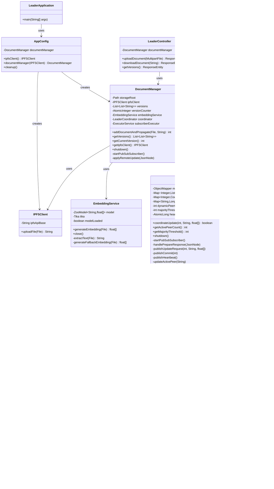

# Diagrama de Classes - Sistema de Gestão de Documentos Distribuído

## 📋 Descrição das Classes

### Pacote `com.sdt.api` (Líder)

- **LeaderApplication**: Ponto de entrada da aplicação Spring Boot
- **AppConfig**: Configuração Spring que cria e injeta beans
- **LeaderController**: API REST para gestão de documentos
- **DocumentManager**: Gerencia documentos, versões e coordena atualizações
- **EmbeddingService**: Gera embeddings semânticos usando modelos ML
- **IPFSClient**: Cliente para interação com IPFS

### Pacote `com.sdt.peers` (Peers)

- **PeerNode**: Nó peer que mantém estado distribuído e processa atualizações
- **LeaderCoordinator**: Coordena protocolo 2PC e envia heartbeats
- **FAISSIndex**: Índice vetorial para busca por similaridade

## 🔗 Relações Principais

- **Composição**: `DocumentManager` contém `EmbeddingService` e `LeaderCoordinator`
- **Agregação**: `PeerNode` contém `FAISSIndex`
- **Dependência**: `LeaderController` depende de `DocumentManager`
- **Comunicação**: `LeaderCoordinator` e `PeerNode` comunicam via PubSub IPFS

