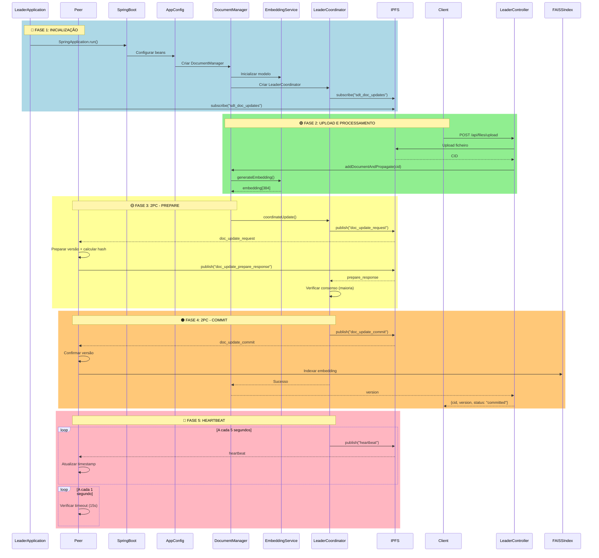

# Diagrama de Sequências - Sistema de Gestão de Documentos Distribuído

## 📋 Legenda de Fases

### 🔵 Fase 1: Inicialização
- Inicialização do Spring Boot e configuração de componentes
- Subscrição ao PubSub IPFS para comunicação distribuída

### 🟢 Fase 2: Upload e Processamento
- Upload de ficheiro para IPFS e obtenção do CID
- Geração de embeddings semânticos (384 dimensões)

### 🟡 Fase 3: 2PC - Prepare
- Líder envia pedido de atualização aos peers
- Peers preparam versão e calculam hash
- Líder verifica consenso (maioria)

### 🟠 Fase 4: 2PC - Commit
- Após consenso, líder envia commit
- Peers confirmam versão e indexam no FAISS
- Retorno de sucesso ao cliente

### 🔴 Fase 5: Heartbeat
- Líder envia heartbeats periódicos (5s)
- Peers monitoram e detetam falhas (timeout: 15s)
