# Diagrama de Sequências - Sistema de Gestão de Documentos Distribuído

```mermaid
sequenceDiagram
    %% FASE 1: INICIALIZAÇÃO
    rect rgb(173, 216, 230)
        Note over LeaderApplication,Peer: 🔵 FASE 1: INICIALIZAÇÃO
        LeaderApplication->>SpringBoot: SpringApplication.run()
        SpringBoot->>AppConfig: Configurar beans
        AppConfig->>DocumentManager: Criar DocumentManager
        DocumentManager->>EmbeddingService: Inicializar modelo
        DocumentManager->>LeaderCoordinator: Criar LeaderCoordinator
        LeaderCoordinator->>IPFS: subscribe("sdt_doc_updates")
        LeaderCoordinator->>LeaderCoordinator: startHeartbeatService()
        LeaderCoordinator->>LeaderCoordinator: startPeerDiscovery()
        Peer->>IPFS: subscribe("sdt_doc_updates")
        Peer->>Peer: startFailureDetection()
        Peer->>Peer: startElectionTimer()
    end
    
    %% FASE 2: UPLOAD E PROCESSAMENTO
    rect rgb(144, 238, 144)
        Note over Client,DocumentManager: 🟢 FASE 2: UPLOAD E PROCESSAMENTO
        Client->>LeaderController: POST /api/files/upload
        LeaderController->>IPFSClient: uploadFile(file)
        IPFSClient->>IPFS: POST /api/v0/add
        IPFS-->>IPFSClient: CID
        IPFSClient-->>LeaderController: CID
        LeaderController->>DocumentManager: addDocumentAndPropagate(file, cid)
        DocumentManager->>EmbeddingService: generateEmbedding(file)
        EmbeddingService-->>DocumentManager: embedding[384]
        DocumentManager->>DocumentManager: Salvar metadados localmente
    end
    
    %% FASE 3: 2PC - PREPARE
    rect rgb(255, 255, 153)
        Note over DocumentManager,Peer: 🟡 FASE 3: 2PC - PREPARE
        DocumentManager->>LeaderCoordinator: coordinateUpdate(version, cid, embedding)
        LeaderCoordinator->>IPFS: publish("doc_update_request")
        IPFS-->>Peer: doc_update_request
        Peer->>Peer: Verificar conflito de versões
        alt Conflito detectado
            Peer->>IPFS: publish("conflict_resolution_request")
            IPFS-->>LeaderCoordinator: conflict_resolution_request
            LeaderCoordinator->>IPFS: publish("conflict_resolution_response")
            IPFS-->>Peer: conflict_resolution_response
        else Sem conflito
            Peer->>Peer: Criar versão temporária (pendingVersions)
            Peer->>Peer: Armazenar embeddings temporariamente (pendingEmbeddings)
            Peer->>Peer: Calcular hash do vetor
            Peer->>IPFS: publish("doc_update_prepare_response") + messageHash
            IPFS-->>LeaderCoordinator: prepare_response
            LeaderCoordinator->>LeaderCoordinator: Validar integridade (messageHash)
            LeaderCoordinator->>LeaderCoordinator: Verificar consenso (maioria)
        end
    end
    
    %% FASE 4: 2PC - COMMIT
    rect rgb(255, 200, 120)
        Note over LeaderCoordinator,Peer: 🟠 FASE 4: 2PC - COMMIT
        LeaderCoordinator->>IPFS: publish("doc_update_commit")
        IPFS-->>Peer: doc_update_commit
        Peer->>Peer: Confirmar versão (remover pending)
        Peer->>Peer: Substituir versão atual
        Peer->>FAISSIndex: add(cid, embedding, version)
        LeaderCoordinator-->>DocumentManager: Sucesso
        DocumentManager-->>LeaderController: version
        LeaderController-->>Client: {cid, version, status: "committed"}
    end
    
    %% FASE 5: PINNING DISTRIBUÍDO
    rect rgb(200, 200, 255)
        Note over LeaderCoordinator,Peer: 🟣 FASE 5: PINNING DISTRIBUÍDO
        LeaderCoordinator->>LeaderCoordinator: assignPinning(cid)
        LeaderCoordinator->>LeaderCoordinator: Selecionar peers (hash determinístico)
        LeaderCoordinator->>LeaderCoordinator: Garantir redundância mínima (2 peers)
        LeaderCoordinator->>IPFS: publish("pinning_assignment")
        IPFS-->>Peer: pinning_assignment
        Peer->>Peer: Verificar se está na lista
        alt Peer atribuído
            Peer->>IPFS: POST /api/v0/pin/add?arg={cid}
            IPFS-->>Peer: Sucesso
            Peer->>Peer: Registrar pinning (cidPinningPeers)
        end
    end
    
    %% FASE 6: HEARTBEAT E DETECÇÃO DE FALHAS
    rect rgb(255, 182, 193)
        Note over LeaderCoordinator,Peer: 🔴 FASE 6: HEARTBEAT E DETECÇÃO
        loop A cada 5 segundos
            LeaderCoordinator->>IPFS: publish("heartbeat") + leader="leader"
            IPFS-->>Peer: heartbeat
            Peer->>Peer: Atualizar lastHeartbeatTimestamp
            Peer->>Peer: Resetar leaderFailed
        end
        loop A cada 1 segundo
            Peer->>Peer: Verificar timeout (15s)
            alt Timeout excedido
                Peer->>Peer: Marcar leaderFailed = true
                Peer->>Peer: onLeaderFailureDetected()
            end
        end
    end
    
    %% FASE 7: ELEIÇÃO RAFT
    rect rgb(255, 160, 122)
        Note over Peer,Peer: 🟠 FASE 7: ELEIÇÃO RAFT (quando líder falha)
        Peer->>Peer: startElection() (após 2x timeout)
        Peer->>Peer: Incrementar currentTerm
        Peer->>Peer: state = CANDIDATE
        Peer->>Peer: votedFor = self
        Peer->>IPFS: publish("raft_request_vote")
        IPFS-->>Peer: raft_request_vote
        Peer->>Peer: Verificar log atualizado
        Peer->>IPFS: publish("raft_vote_response")
        IPFS-->>Peer: raft_vote_response
        Peer->>Peer: Contar votos (maioria)
        alt Maioria alcançada
            Peer->>Peer: becomeLeader()
            Peer->>Peer: initiateDataRecovery()
        end
    end
    
    %% FASE 8: RECUPERAÇÃO DE DADOS
    rect rgb(255, 218, 185)
        Note over Peer,Peer: 🟡 FASE 8: RECUPERAÇÃO DE DADOS (novo líder)
        Peer->>IPFS: publish("raft_recovery_request")
        IPFS-->>Peer: raft_recovery_request
        Peer->>Peer: Preparar resposta com todas estruturas
        Note over Peer: Estruturas permanentes:<br/>versions, confirmedVersion, faissIndex
        Note over Peer: Estruturas temporárias:<br/>pendingVersions, pendingEmbeddings, pendingCids
        Peer->>IPFS: publish("raft_recovery_response")
        IPFS-->>Peer: raft_recovery_response
        Peer->>Peer: Receber respostas de maioria
        Peer->>Peer: completeDataRecovery()
        Peer->>Peer: Mesclar dados de todos os peers
        Peer->>Peer: Atualizar estruturas permanentes
        Peer->>Peer: Limpar estruturas temporárias antigas
        Peer->>IPFS: publish("raft_leader_announcement")
        IPFS-->>Peer: raft_leader_announcement
    end
    
    %% FASE 9: RECUPERAÇÃO DE PINNING
    rect rgb(221, 160, 221)
        Note over LeaderCoordinator,Peer: 🟣 FASE 9: RECUPERAÇÃO DE PINNING (peer falha)
        LeaderCoordinator->>LeaderCoordinator: cleanupInactivePeers()
        LeaderCoordinator->>LeaderCoordinator: recoverPinningForFailedPeer(failedPeer)
        LeaderCoordinator->>LeaderCoordinator: Verificar redundância por CID
        alt Redundância < 2
            LeaderCoordinator->>LeaderCoordinator: Selecionar novos peers
            LeaderCoordinator->>IPFS: publish("pinning_recovery_request")
            IPFS-->>Peer: pinning_recovery_request
            Peer->>Peer: Verificar se precisa assumir pinning
            alt Precisa assumir
                Peer->>IPFS: POST /api/v0/pin/add?arg={cid}
                IPFS-->>Peer: Sucesso
                Peer->>Peer: Atualizar cidPinningPeers
            end
        end
    end
```

## 📋 Legenda de Fases

### 🔵 Fase 1: Inicialização
- Inicialização do Spring Boot e configuração de componentes
- Subscrição ao PubSub IPFS para comunicação distribuída
- Inicialização de serviços: heartbeat, descoberta de peers, detecção de falhas
- Inicialização de timer de eleição RAFT

### 🟢 Fase 2: Upload e Processamento
- Upload de ficheiro para IPFS e obtenção do CID
- Geração de embeddings semânticos (384 dimensões) usando all-MiniLM-L6-v2
- Armazenamento de metadados localmente

### 🟡 Fase 3: 2PC - Prepare
- Líder envia pedido de atualização aos peers
- **Resolução de conflitos**: Se houver conflito de versões, inicia processo de resolução
- Peers preparam versão temporária e calculam hash
- **Segurança**: Adiciona messageHash para integridade
- Líder valida integridade e verifica consenso (maioria)

### 🟠 Fase 4: 2PC - Commit
- Após consenso, líder envia commit
- Peers confirmam versão (removem pending, atualizam confirmedVersion)
- Peers indexam embedding no FAISS
- Retorno de sucesso ao cliente

### 🟣 Fase 5: Pinning Distribuído
- **Algoritmo distribuído**: Líder determina quais peers fazem pinning usando hash determinístico do CID
- **Redundância**: Garante mínimo de 2 peers por ficheiro
- Peers atribuídos executam pinning no IPFS
- Rastreamento de quais peers fazem pinning de cada CID

### 🔴 Fase 6: Heartbeat e Detecção de Falhas
- Líder envia heartbeats periódicos (5s) com identificação do líder
- Peers monitoram e atualizam timestamp
- **Detecção de falha**: Após 15s sem heartbeat, marca líder como falhado
- Peers iniciam processo de eleição após 2x timeout (30s)

### 🟠 Fase 7: Eleição RAFT
- **Protocolo RAFT**: Candidatos enviam RequestVote
- Peers votam baseado em termo e log atualizado
- Candidato com maioria se torna líder
- Novo líder inicia recuperação de dados

### 🟡 Fase 8: Recuperação de Dados
- **Recuperação completa**: Novo líder solicita todas as estruturas de dados
- **Estruturas permanentes**: versions, confirmedVersion, faissIndex (embeddings + CIDs)
- **Estruturas temporárias**: pendingVersions, pendingEmbeddings, pendingCids
- Mesclagem de dados de todos os peers
- **Timeout**: Recuperação completa em até 30 segundos
- Anúncio de novo líder

### 🟣 Fase 9: Recuperação de Pinning
- **Detecção automática**: Quando peer falha, líder detecta em cleanupInactivePeers()
- **Verificação de redundância**: Para cada CID, verifica se ainda tem 2+ peers
- **Redistribuição**: Atribui novos peers para manter redundância mínima
- Peers assumem pinning automaticamente

## 🔒 Segurança (RNF6)

- **Integridade**: Todas as mensagens incluem `messageHash` (SHA-256)
- **Validação**: Peers validam integridade antes de processar mensagens
- **Timestamp**: Mensagens incluem timestamp para não repudiação básica
- Mensagens com integridade comprometida são rejeitadas

## 📊 Fluxo Completo de Upload

1. Cliente faz upload → IPFS retorna CID
2. Líder gera embeddings
3. Líder inicia 2PC (Prepare)
4. Peers verificam conflitos e preparam versão
5. Líder verifica consenso e envia Commit
6. Peers confirmam e indexam no FAISS
7. **Líder atribui pinning distribuído (2+ peers)**
8. Cliente recebe confirmação

## 🔄 Recuperação Após Falha

1. Peer detecta falha do líder (timeout 15s)
2. Após 30s, inicia eleição RAFT
3. Novo líder eleito com maioria
4. **Recuperação completa de todas estruturas** (permanentes + temporárias)
5. **Recuperação de pinning** para manter redundância
6. Sistema operacional novamente
