# Diagrama de Sequências - RF2: Pesquisa de Informação

```mermaid
sequenceDiagram
    %% FASE 1: CLIENTE ENVIA PESQUISA
    rect rgb(173, 216, 230)
        Note over Client,LeaderController: 🔵 FASE 1: CLIENTE ENVIA PESQUISA
        Client->>LeaderController: POST /api/files/search<br/>{prompt: "texto da pesquisa"}
        LeaderController->>DocumentManager: initiateSearch(prompt)
        DocumentManager->>DocumentManager: Gerar searchId (UUID)
        DocumentManager->>DocumentManager: Criar arquivo temporário com prompt
        DocumentManager->>EmbeddingService: generateEmbedding(promptFile)
        EmbeddingService-->>DocumentManager: queryEmbedding[384]
        DocumentManager->>DocumentManager: Remover arquivo temporário
    end
    
    %% FASE 2: DISTRIBUIÇÃO PARA PEER
    rect rgb(144, 238, 144)
        Note over DocumentManager,Peer: 🟢 FASE 2: DISTRIBUIÇÃO PARA PEER
        DocumentManager->>LeaderCoordinator: distributeSearchRequest(searchId, prompt, queryEmbedding)
        LeaderCoordinator->>LeaderCoordinator: Obter lista de peers ativos
        LeaderCoordinator->>LeaderCoordinator: Selecionar peer (round-robin)<br/>peerIndex = counter % peers.size()
        LeaderCoordinator->>LeaderCoordinator: Gerar token (UUID)
        LeaderCoordinator->>LeaderCoordinator: Armazenar searchId -> peer<br/>(searchIdToPeer)
        LeaderCoordinator->>IPFS: publish("search_request")<br/>{searchId, token, prompt, queryEmbedding, targetPeer}
        IPFS-->>Peer: search_request
        DocumentManager->>DocumentManager: Inicializar resultado<br/>{id, status: "processing"}
        DocumentManager-->>LeaderController: searchId
        LeaderController-->>Client: {id: "uuid", status: "processing"}
    end
    
    %% FASE 3: PROCESSAMENTO NO PEER
    rect rgb(255, 255, 153)
        Note over Peer,FAISSIndex: 🟡 FASE 3: PROCESSAMENTO NO PEER
        Peer->>Peer: handleSearchRequest()
        Peer->>Peer: Verificar se é targetPeer
        alt Peer designado
            Peer->>Peer: Processar pesquisa
            Peer->>FAISSIndex: search(queryEmbedding, k=5)
            FAISSIndex->>FAISSIndex: Normalizar queryEmbedding
            FAISSIndex->>FAISSIndex: Calcular cosine similarity<br/>com todos os embeddings
            FAISSIndex->>FAISSIndex: Ordenar por similaridade
            FAISSIndex->>FAISSIndex: Retornar top k CIDs
            FAISSIndex-->>Peer: Lista de CIDs relevantes
            Peer->>Peer: Armazenar resultado localmente<br/>(searchResults.put(searchId, result))
            Note over Peer: Resultado armazenado:<br/>{searchId, status: "completed",<br/>results: [cids...], timestamp}
        else Peer não designado
            Peer->>Peer: Ignorar pesquisa<br/>(não processar)
        end
    end
    
    %% FASE 4: RESPOSTA DO PEER
    rect rgb(255, 200, 120)
        Note over Peer,DocumentManager: 🟠 FASE 4: RESPOSTA DO PEER
        Peer->>Peer: publishSearchResultResponse()
        Peer->>Peer: Calcular messageHash<br/>(integridade)
        Peer->>IPFS: publish("search_result_response")<br/>{searchId, peer, status: "completed",<br/>results: [cids...], messageHash}
        IPFS-->>DocumentManager: search_result_response
        DocumentManager->>DocumentManager: handleSearchResultResponse()
        DocumentManager->>DocumentManager: Validar integridade (messageHash)
        DocumentManager->>DocumentManager: Atualizar searchResults<br/>{status: "completed", results, peer}
    end
    
    %% FASE 5: CLIENTE SOLICITA RESULTADO
    rect rgb(200, 200, 255)
        Note over Client,Peer: 🟣 FASE 5: CLIENTE SOLICITA RESULTADO
        Client->>LeaderController: GET /api/files/search/{id}
        LeaderController->>DocumentManager: getSearchResult(searchId)
        DocumentManager->>DocumentManager: Verificar searchResults
        alt Resultado disponível
            DocumentManager-->>LeaderController: {status: "completed", results, peer}
            LeaderController-->>Client: {status: "completed",<br/>results: [cids...],<br/>peer: "peer-2"}
        else Resultado ainda processando
            DocumentManager->>LeaderCoordinator: requestSearchResult(searchId)
            LeaderCoordinator->>LeaderCoordinator: Obter peer do searchIdToPeer
            LeaderCoordinator->>IPFS: publish("search_result_request")<br/>{searchId, requestedFrom: peer}
            IPFS-->>Peer: search_result_request
            Peer->>Peer: handleSearchResultRequest()
            Peer->>Peer: Verificar searchResults local
            alt Resultado disponível no peer
                Peer->>IPFS: publish("search_result_response")<br/>{searchId, status: "completed", results}
                IPFS-->>DocumentManager: search_result_response
                DocumentManager->>DocumentManager: Atualizar resultado
                DocumentManager-->>LeaderController: {status: "completed", results}
                LeaderController-->>Client: {status: "completed", results}
            else Resultado não disponível
                Peer->>IPFS: publish("search_result_response")<br/>{status: "processing"}
                IPFS-->>DocumentManager: search_result_response
                DocumentManager-->>LeaderController: {status: "processing"}
                LeaderController-->>Client: {status: "processing",<br/>message: "try again later"}
            end
        end
    end
```



## 📋 Legenda de Fases

### 🔵 Fase 1: Cliente Envia Pesquisa
- Cliente envia prompt de pesquisa via POST `/api/files/search`
- Líder gera ID único (UUID) para rastrear a pesquisa
- Líder gera embedding semântico da prompt usando o mesmo modelo (all-MiniLM-L6-v2)
- Embedding gerado tem 384 dimensões (compatível com FAISS)

### 🟢 Fase 2: Distribuição para Peer
- **Distribuição de carga**: Líder usa round-robin para selecionar qual peer processa
- Líder gera token único (UUID) para a pesquisa
- Líder armazena mapeamento `searchId -> peer` para rastreamento
- Líder publica mensagem `search_request` via IPFS PubSub
- Líder retorna ID ao cliente com status "processing"

### 🟡 Fase 3: Processamento no Peer
- **Aceitação de token**: Peer verifica se é o `targetPeer` designado
- **Busca FAISS**: Peer usa índice FAISS para buscar documentos mais relevantes
  - Normaliza embedding de consulta
  - Calcula cosine similarity com todos os embeddings indexados
  - Ordena por similaridade (mais similar primeiro)
  - Retorna top k CIDs (padrão: k=5)
- **Armazenamento local**: Peer armazena resultado em `searchResults` (Map<searchId, resultado>)
- Resultado inclui: searchId, status, lista de CIDs, timestamp

### 🟠 Fase 4: Resposta do Peer
- Peer publica `search_result_response` via IPFS PubSub
- **Segurança**: Mensagem inclui `messageHash` para integridade
- Líder recebe resposta e valida integridade
- Líder atualiza `searchResults` com resultado completo

### 🟣 Fase 5: Cliente Solicita Resultado
- Cliente faz GET `/api/files/search/{id}` para obter resultado
- **Se resultado disponível**: Líder retorna imediatamente
- **Se ainda processando**: Líder solicita ao peer que processou
- Peer verifica resultado local e envia se disponível
- Cliente recebe resultado com lista de CIDs relevantes

## 🔄 Fluxo Completo de Pesquisa

1. **Cliente → Líder**: Envia prompt de pesquisa
2. **Líder**: Gera ID, token e embedding da prompt
3. **Líder → Rede**: Distribui pesquisa para peer (round-robin)
4. **Líder → Cliente**: Retorna ID da pesquisa
5. **Peer**: Processa pesquisa usando FAISS
6. **Peer**: Armazena resultado localmente
7. **Peer → Líder**: Envia resultado via PubSub
8. **Cliente → Líder**: Solicita resultado com ID
9. **Líder → Peer**: Solicita resultado se necessário
10. **Líder → Cliente**: Retorna lista de CIDs relevantes

## 🔍 Detalhes Técnicos

### Distribuição de Carga
- **Round-robin**: Líder usa contador para distribuir pesquisas entre peers
- **Token único**: Cada pesquisa tem token UUID para identificação
- **Rastreamento**: Líder mantém `searchIdToPeer` para saber qual peer processou

### Busca FAISS
- **Similaridade**: Usa cosine similarity entre embeddings
- **Normalização**: Embeddings são normalizados (L2) antes de comparação
- **Top K**: Retorna os k documentos mais similares (padrão: 5)
- **Resultado**: Lista de CIDs ordenados por relevância

### Armazenamento
- **Peer**: Armazena resultado em `searchResults` (Map local)
- **Líder**: Armazena resultado em `searchResults` após receber do peer
- **Estrutura**: `{searchId, status, results: [cids...], peer, timestamp}`

### Segurança
- **Integridade**: Mensagens incluem `messageHash` (SHA-256)
- **Validação**: Líder valida integridade antes de processar
- **Timestamp**: Mensagens incluem timestamp para rastreamento

## 📊 Exemplo de Uso

### Requisição Inicial
```http
POST /api/files/search
Content-Type: application/json

{
  "prompt": "documentos sobre machine learning"
}
```

### Resposta (Fase 1)
```json
{
  "id": "9b6a95dd-251a-4eca-82f6-2ea39b4c18a7",
  "status": "processing",
  "message": "Search request submitted, use GET /api/files/search/{id} to retrieve results"
}
```

### Solicitação de Resultado
```http
GET /api/files/search/9b6a95dd-251a-4eca-82f6-2ea39b4c18a7
```

### Resposta (Fase 2)
```json
{
  "id": "9b6a95dd-251a-4eca-82f6-2ea39b4c18a7",
  "status": "completed",
  "results": [
    "QmZA7dv1CxGsVaMw5Htuc2AWa98FSNNjeVRTKLMNwTfHbw",
    "QmXyZ123..."
  ],
  "peer": "peer-2",
  "completedAt": 1702034567890
}
```

## 🔒 Segurança (RNF6)

- **Integridade**: Mensagens `search_result_response` incluem `messageHash`
- **Validação**: Líder valida integridade antes de atualizar resultados
- **Rastreamento**: Cada pesquisa tem ID e token únicos
- **Timestamp**: Mensagens incluem timestamp para auditoria

## ⚡ Otimizações Futuras

- **Cache**: Resultados poderiam ser cacheados por prompt similar
- **Geração de resposta**: Peer poderia gerar resposta usando modelo ML offline
- **Download de documentos**: Cliente poderia usar CIDs para baixar documentos do IPFS
- **Filtragem**: Adicionar filtros adicionais (data, tipo, etc.)

